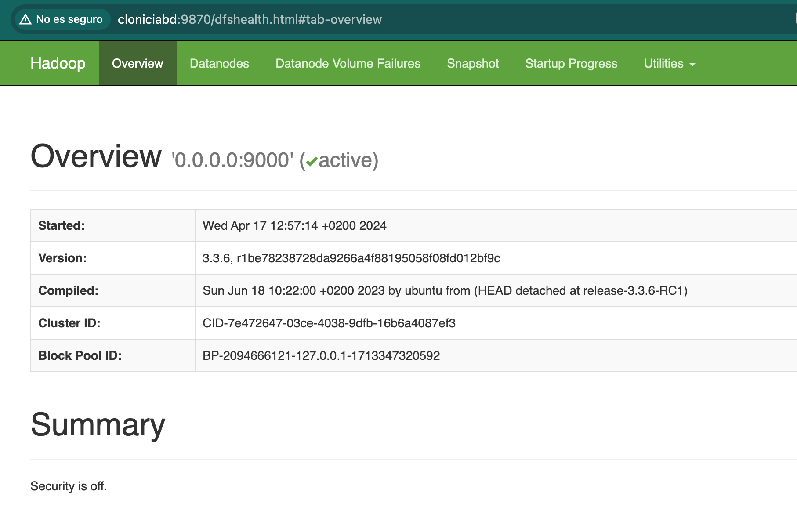

Instalamos hadoop en un servidor (`cloniciabd`) en modo standalone.
Posteriormente realizaremos las modificaciones necesarias para crear un cluster con 4 ordenadores más utilizando este como servidor.
## Consideraciones

- Instalaremos todo en `/opt`
- Utilizaremos el usuario `hadoop`
- Los datos se guardarán en `/datos`

- IP del server 172.28.255.253
- Hostname cloniciabd
* Archivo /etc/hosts
```
127.0.0.1	localhost
127.0.0.1	cloniciabd
172.28.255.253	cloniciabd
```

## Requerimientos
- Hadoop-3.3.6
- Java 11 -> No soporta versiones superiores
	- Se puede instalar  jdk-11 o la versión open-jdk-11
	- [https://cfdownload.adobe.com/pub/adobe/coldfusion/java/java11/java11020/jdk-11.0.20_linux-x64_bin.deb](https://cfdownload.adobe.com/pub/adobe/coldfusion/java/java11/java11020/jdk-11.0.20_linux-x64_bin.deb)

## Creación/Configuración usuario hadoop

`adduser hadoop`

Nos logueamos con el user `hadoop`que hemos creado.

¿Cómo sabemos la ruta al Java que hemos instalado?
```
ls /usr/lib/jvm/*
# Aquí veremos a qué carpeta haremos referencia posteriormente
# En mi caso /usr/lib/jvm/java-11-openjdk-amd64
```


Modificar .bashrc con el PATH de Java.
```
export JAVA_HOME=/usr/lib/jvm/java-11-openjdk-amd64
export PATH=$PATH:/usr/lib/jvm/java-11-openjdk-amd64/bin
```

Recargamos la configuración y comprobamos la versión de Java
```
source .bashrc

$ java --version
openjdk 11.0.22 2024-01-16
OpenJDK Runtime Environment (build 11.0.22+7-post-Ubuntu-0ubuntu222.04.1)
OpenJDK 64-Bit Server VM (build 11.0.22+7-post-Ubuntu-0ubuntu222.04.1, mixed mode, sharing)
```

## Descargamos hadoop

Como root:

```
## Vamos al directorio de trabajo
cd /opt/
wget https://dlcdn.apache.org/hadoop/common/hadoop-3.3.6/hadoop-3.3.6.tar.gz

## Descomprimimos
tar -zxvf hadoop-3.3.6.tar.gz
ls -la

## Creamos un enlace para trabajar de manera más cómoda
ln -s hadoop-3.3.6 hadoop
ls -la

## Cambiamos el propietario y grupo de la carpeta y enlace creado
chown -R hadoop:hadoop hadoop-3.3.6 hadoop

## Entramos a la carpeta descomprimida (a través del enlace creado)
cd hadoop
```

## Configuración hadoop

```
cd /opt/hadoop/etc/hadoop/
```

Editamos el archivo `core-site.xml` (nano, vi... )
```
<configuration>
    <property>
        <name>fs.default.name</name>
        <value>hdfs://0.0.0.0:9000</value>
    </property>
    <property>
    	<name>hadoop.http.staticuser.user</name>
    	<value>hadoop</value>
    </property>
</configuration>
```
*Si pongo la IP del server en vez de 0.0.0.0 da error -> revisar*
*La parte de staticuser nos permite subir archivos con webdfs*

Editamos el archivo `hdfs-site.xml`
```
<configuration>
	<property>
        <name>dfs.namenode.name.dir</name>
        <value>/datos/namenode</value>
	</property>
	<property>
        <name>dfs.datanode.data.dir</name>
        <value>/datos/datanode</value>
	</property>
	<property>
        <name>dfs.replication</name>
        <value>2</value>
	</property>
	<property>
        <name>dfs.webhdfs.enabled</name>
        <value>true</value>
	</property>
	<property>
        <name>dfs.namenode.http-address</name>
        <value>0.0.0.0:9870</value>
	</property>
</configuration>
```

Editamos el archivo `mapred-site.xml`
```
<configuration>
	<property>
        <name>mapreduce.framework.name</name>
        <value>yarn</value>
	</property>
	<property>
        <name>yarn.app.mapreduce.am.env</name>
        <value>HADOOP_MAPRED_HOME=$HADOOP_HOME</value>
	</property>
	<property>
        <name>mapreduce.map.env</name>
        <value>HADOOP_MAPRED_HOME=$HADOOP_HOME</value>
	</property>
	<property>
        <name>mapreduce.reduce.env</name>
        <value>HADOOP_MAPRED_HOME=$HADOOP_HOME</value>
	</property>

</configuration>
```

## Creación carpeta de datos

Como root

```
mkdir -p /datos/{namenode,datanode}
chown -R hadoop:hadoop /datos
```

## Modificamos .bashrc con las rutas de hadoop

Como usuario hadoop.
Editamos de nuevo .bashrc y añadimos:
```
# HADOOP_HOME sin barra final
export HADOOP_HOME=/opt/hadoop
export HADOOP_CONF_DIR=$HADOOP_HOME/etc/hadoop
export PATH=$PATH:$HADOOP_HOME/bin
export PATH=$PATH:$HADOOP_HOME/sbin

# Estas dos líneas ya las tenemos
export JAVA_HOME=/usr/lib/jvm/java-11-openjdk-amd64
export PATH=$PATH:/usr/lib/jvm/java-11-openjdk-amd64/bin

```

Recargamos la configuración y comprobamos la configuración de hadoop
```
source .bashrc

$ hadoop version
Hadoop 3.3.6
Source code repository https://github.com/apache/hadoop.git -r 1be78238728da9266a4f88195058f08fd012bf9c
Compiled by ubuntu on 2023-06-18T08:22Z
Compiled on platform linux-x86_64
Compiled with protoc 3.7.1
From source with checksum 5652179ad55f76cb287d9c633bb53bbd
This command was run using /opt/hadoop-3.3.6/share/hadoop/common/hadoop-common-3.3.6.jar
```

## Importante: preparamos el almacenamiento

Para que hadoop pueda trabajar, hemos de formatear el sistema de archivos.

Formateamos con HDFS
```hdfs namenode -format```

## Levantamos hadoop

Como usuario `hadoop`

Si todo ha ido bien podemos levantar `hadoop`
```
$ start-dfs.sh

$ start-yarn.sh
```

## Acceso
Ya podemos acceder a la WebUI puerto 9870
